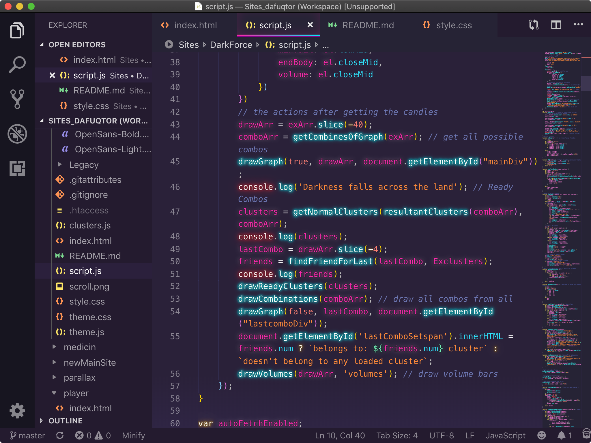

<h1 align="center">macOS Essentials</h1>
<p align="center">Apps and sets that are nice to use on our beatiful system of choice.</p>

##### Contents

- [Applications](#applications)
  - [Productivity](#productivity)
  - [Code](#code)
  - [Social](#social)
  - [Browsers](#browsers)
    - [Safari Extensions](#safari-extensions)
  - [Music](#music)
  - [Video](#video)
  - [Images](#images)
  - [Utilities](#utilties)
- [Command Line tools](#command-line-tools)
  - [Packages](#packages)

## Applications

Most of them are the newest and most convenient applications, replacing the already outdated ones.

### Productivity

#### [Maccy](https://github.com/p0deje/Maccy) - clipboard manager

- Keeps the history of what you copy and lets you easily navigate, search and use previous clipboard contents.


- It has wonderful <kbd>⌘</kbd>+<kbd>⇧</kbd>+<kbd>C</kbd> shortcut, but I changed it to <kbd>⌥</kbd>+<kbd>⇧</kbd>+<kbd>C</kbd> because the initial option is used in many other applications.

#### [Folx](https://mac.eltima.com/torrent-client.html) - Torrent Client

- An excellent minimalistic torrent downloader. Makes downloading torrent files and creating torrents for various trackers extremely easy.

#### [Lungo](https://sindresorhus.com/lungo) - A menu bar app that keeps your Mac awake.
> Modern alternative to [Caffeine](https://www.macupdate.com/app/mac/24120/caffeine)

- Many various preferences.
- Scriptable.
- Not so heavy like [Amphetamine](https://apps.apple.com/us/app/amphetamine/id937984704).

### Code

#### [VS Code](https://github.com/Microsoft/vscode) — Main code editor

- Easy-to-use with large projects.
- The best editor with many extensions that I use to write code in.
- I like to use VSC SynthWave '84 theme. Here is how it looks:



#### [Sublime Text](https://www.sublimetext.com) - Additional Text Editor

- Use this editor in addition to VSC for its blazing fast speed of opening files.
- I use it just to quickly edit configs and markdown files.
- Built-in Monokai theme (dark, yea).

#### [GitHub Desktop](https://desktop.github.com) - Git client

- Convenient version control.
- Has a wonderful dark theme.

### Social

#### [Telegram](https://desktop.telegram.org/) - Fastest Messenger
> All other messengers just suck.

- Native and clean interface.
- Stickers.
- ???

#### [Spark](https://sparkmailapp.com/) - Email client

- Cool categorizaton of emails.
- Just. looks. nice. (And is extremely fast)

#### [Flume](https://flumeapp.com) - Instagram client

- Allows to do everything we do in Instagram on mobiles.

### Browsers

#### [Safari](https://www.apple.com/lae/safari/)

- It's just native to macOS, which means incredible speed and the lowest battery waste.

##### Safari Extensions

- [OverPicture](https://apps.apple.com/us/app/overpicture-for-safari/id1188020834) - Allows you to play any web video in Picture-In-Picture mode. It also has a nice <kbd>P</kbd> shortcut and the custom button in popular players like YouTube.
- [AdGuard](https://adguard.com/en/adguard-mac/overview.html) - Ad content blocker based on [Safari native content blocking API's](https://developer.apple.com/library/content/documentation/Extensions/Conceptual/ContentBlockingRules/Introduction/Introduction.html).
- [Cascadea](https://cascadea.app) - Custom styles. Allows importing of themes from Stylish, which has really wide community. I use it to create or install dark themes for websites without a dark mode option. 
- [Dark Reader](https://darkreader.org/safari/) - For websites that don't have a nice Stylish theme, I use Dark Reader to let my eyes enjoy the dark mode.
- [Ghounter](https://apps.apple.com/us/app/ghounter/id1438633677) - Displays the downloads count on any public Releases page in GitHub.
- [AutoPagerize](https://safari-extensions.apple.com/details/?id=net.autopagerize.autppagerizeforsafari-XH6FQ533G6) - Auto-loads paginated websites (e.g. Google Search).

#### [Google Chrome](https://www.google.com/chrome/)

- Indispensably good Dev tools for web development.
- Overtakes Safari in the number of extensions.

### Music

#### [Shazam](https://apps.apple.com/us/app/shazam/id897118787) - Menu bar that discovers music, video & lyrics
> Siri already has built-in Shazam, but it sucks.

- Old known app now on desktop.
- One click shazaming.
- Configurable keyboard shortcut.

#### [NepTunes](https://micropixels.software/neptunes) - iTunes and Spotify controller

- All media actions from beautiful artwork on your Desktop.
- It can replace default track changing notfication.

### Video

#### [Beamer](https://beamer-app.com) - Stream to Apple TV and Chromecast

- Super-minimalistic UI.
- Fast connection.
- All common video formats. Never had any troubles.
- All popular subtitle formats are also supported.

#### [IINA](https://github.com/lhc70000/iina) - Video player

- Based on mpv.
- It's like VLC, but fast, modern and native.

### Images

#### [Photoshop](https://www.adobe.com/products/photoshop.html) - Edit photos
> My second hobby.

- Doesn't need to be present, yea?

#### [ImageOptim](https://imageoptim.com/mac) - better Save for Web

- Reduces image file sizes.
- Removes invisible junk (comments, thumbnails and other metadata).
- Has a service which is easily accessible from RMB click on image in Finder.

### Utilities

#### [AppCleaner](https://freemacsoft.net/appcleaner/) - Fully uninstall unwanted apps

- Finds all the files using space of your Hard Drive unnecessarily after deleting the app to which these files belong.
- Auto-asks to remove residual files when you delete app from Applications folder.

## Command Line tools

### [Homebrew](https://brew.sh/)

> Essential package manager for macOS.

Allows you to run `brew install <package>` and `brew cask install <app>` to install nearly everything you need.

#### Install Homebrew

```powershell
/usr/bin/ruby -e "$(curl -fsSL https://raw.githubusercontent.com/Homebrew/install/master/install)"
```

### Packages

> Remember, just `brew install <package>` — 3 seconds for the magic to appear!

- [youtube-dl](https://github.com/rg3/youtube-dl) - Download media from YouTube and other video sites.

- [thefuck](https://github.com/nvbn/thefuck) - Corrects errors in previous console commands.

    ```powershell
    $ puthon
    No command 'puthon' found
    $ fuck
    Python 3.4.2 (default, Oct  8 2014, 13:08:17)
    ```

- [qrencode](https://fukuchi.org/works/qrencode/index.html.en) - Accepts a string or a list of data chunks then encodes in a QR Code symbol as a bitmap array.

### Functions

> An assorted collection of useful macOS Bash-style functions.

#### Get current Wi-Fi password

    run `wifi_pass`, maybe adding ` -c` to get the result to your clipboard

```powershell
ssid() {
    /System/Library/PrivateFrameworks/Apple80211.framework/Versions/Current/Resources/airport -I | awk '/ SSID/ {print substr($0, index($0, $2))}'
}
wifi-pass() {
  local ssid=$(ssid)
  if [ "$1" != "" ]; then
    case $1 in
      -c | --copy )
        if [ "$2" != "" ]; then
          wifi-pass $2 | tr -d '\n' | pbcopy
        else
          wifi-pass -c $ssid
        fi
      ;;
      -qr | --qrencode )
        if [ "$2" != "" ]; then
          qrencode -o ~/Desktop/$2.png -s 20 -m 3 "WIFI:S:$2;T:WPA;P:$(wifi-pass $2);;"
        else
          wifi-pass -qr $ssid
        fi
      ;;
      * )
        security find-generic-password -D "AirPort network password" -a "$1" -gw
    esac
  else
    wifi-pass $ssid
  fi
}
```

With [qrencode](#packages) package installed, you can extend the `wifi-pass` function to make a QR code that can be scanned using a mobile phone to join your network:

```powershell
wifi-pass -qr <ssid>
```

### Profiling functions

> Use this to quickly enable new settings you get on the web

```bash
edit() {
    open .bash_profile
}
reload() {
    . .bash_profile
}
```

### Highlight Effect to Stacks View in macOS

```powershell
defaults write com.apple.dock mouse-over-hilite-stack -boolean yes; killall Dock
```

### Printing

#### Clear Print Queue

```bash
cancel -a -
```

#### Quit Printer App After Print Jobs Complete

```powershell
defaults write com.apple.print.PrintingPrefs "Quit When Finished" -bool true
```

### System

##### Set Login Window text

```powershell
sudo defaults write /Library/Preferences/com.apple.loginwindow LoginwindowText "Can't touch this..."
```

---

If you're still wondering dfq for I created this repo — I want to be able to fuck my MacBook on the floor right now, buy a new one and return all my settings, a little remembering how and why they are needed.
